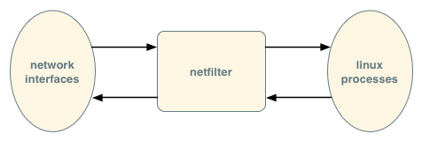
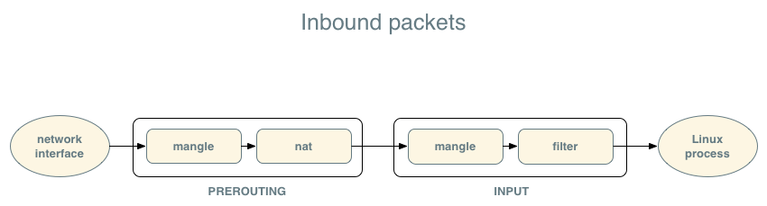
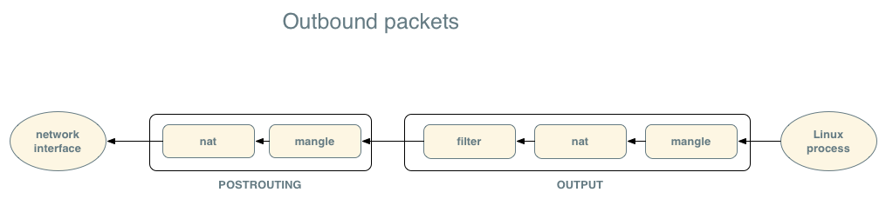
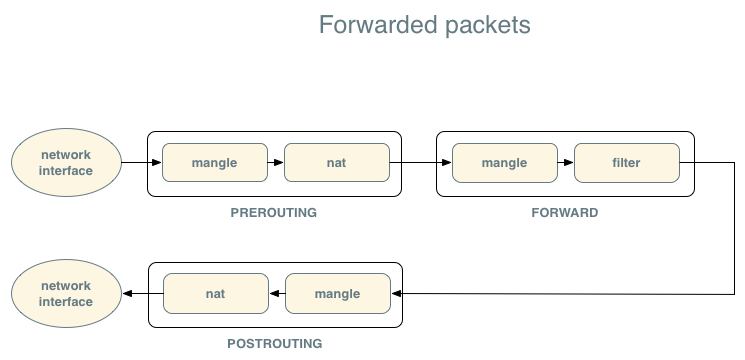

========
iptables
========

*iptables* is a Linux command-line tool for configuring Linux kernel's IP packet
filtering framework. The packet filtering framework, known as netfilter_ enables
a Linux server to be configured to behave as a firewall or a NAT router (see :ref:`NAT`).
Note that even though it is netfilter that implements this functionality, many people refer
to the packet filtering system itself as "iptables", and we will adopt this
convention here.

.. _netfilter: http://www.netfilter.org/

You can think of netfilter at a module that resides between the network interfaces
and the software applications on a Linux server. Packets that come in from a
network interface pass through netfilter before reaching the receiving process,
and all packets sent from a process pass through netfilter before reaching the
network interface. If the Linux server is acting as a router, with packets
coming in one interface and leaving through another, these packets also pass
through netfilter.

OpenStack uses iptables as part of the implementation for the following features:

* security groups
* floating IPs
* allowing instances with private IPs to make outbound connectsiont to the
  Internet
* metadata service routing

iptables uses a rule-based system. A user defines a set of rules about whether
packets should be permitted, dropped, or modified. Here is an example of an
iptables rule::

    -A neutron-l3-agent-PREROUTING -d 172.24.4.3/32 -j DNAT --to-destination 10.0.0.3

This is one of the rules that implements floating IPs: it changes the
destination of an IP packet from 172.24.4.3 to 10.0.0.3.

The rules are the *what*, they tell netfilter what to do with a packet.

Every iptables rule is associated with exactly one *table* and exactly one
*chain*.

Table
~~~~~
iptables groups rules by functionality into *tables*, as shown below:

.. list-table:: iptables tables
   :header-rows: 1

   * - Name
     - Purpose
     - OpenStack usage
   * - *nat*
     - NAT functionality
     - floating IPs, outbound connections, metadata routing
   * - *filter*
     - firewall funtionality
     - security groups, firewall-as-a-service
   * - *mangle*
     - miscellaneous packet modification (excluding NAT)
     - workaround for DHCP checksum problem, detect invalid access to
       metadata service
   * - *raw*
     - mark packets that should not be tracked by netfilter
     - not used by OpenStack
   * - *security*
     - used by Linux Security modules such as SELinux to implement mandatory
       access control networking rules
     - not used by OpenStack

As OpenStack Network does not make use of the *raw* or *security* tables, we do
not discuss them any further in this document.

Chains
~~~~~~

The netfilter system processes IP packets in stages, and allows iptables users
to specify which stage the iptables should be applied to packets. You can think
of a *chain* as one of the stages of packet filtering that conatins a list of
iptables rules.

The iptables toolset defines built-in five chains:

.. list-table:: iptables chains
   :header-rows: 1

   * - Name
     - When processed
   * - PREROUTING
     - immediately after NIC receives inbound packet
   * - INPUT
     - before netfilter passes inbound packet to Linux process
   * - FORWARD
     - after PREROUTING, for inbound packets that are routed to another host
   * - OUTPUT
     - after Linux process emits outbound packet
   * - POSTROUTING
     - immediately before netfilter passes outbound packet to NIC

Each table consists of a list of chains, and some tables do not contain all of
the built-in chains. For example, the nat table has a PREROUTING chain,
POSTROUTING chain, and OUTPUT chain, but does not have an INPUT or FORWARD
chain.

The diagrams below shows how packets pass through the chains of the different
tables as they move inbound from NIC to Linux process, outbound from Linux
process to NIC, and (when the Linux host is acting as a router) forwarded from
one NIC to another.

Once one of the rules in a chain matches the packet, netfilter stops evaluating
that chain and moves to the next one (unless the matched rule is to drop the
packet, in which case processing stops). For example, for an inbound packet,
once the one of the rules in the PREROUTING chain of the mangle table matches,
netfilter stops evaluating that chain and starts evaluating the PREROUTING chain
of the nat table.

Policies
~~~~~~~~

Each of the default chains must define a *policy* which tells netfilter what to
do if none of the rules in the chain applied to the packet. The most common
policies are ACCEPT (allow the packet through), DROP (discard the packet) and
REJECT (discard the packet and send an ICMP message to the sour

.. list-table:: iptables policies
   :header-rows: 1

   * - Name
     - Behavior
   * - ACCEPT
     - permit the packet to continue being processed
   * - DROP
     - discard the packet
   * - REJECT
     - discard the packet, send an ICMP "port unreachable" message to the sender

You can view the policies using the :command:`iptables` command. In the
following example, all of the chains in the filter table have a policy of
ACCEPT, which is typical on a system where there is no local firewall
configured::

    # iptables -t filter -L
    Chain INPUT (policy ACCEPT)
    target     prot opt source               destination

    Chain FORWARD (policy ACCEPT)
    target     prot opt source               destination

    Chain OUTPUT (policy ACCEPT)
    target     prot opt source               destination

Note that :command:`iptables` assumes filter is the default table so the ``-t
filter`` arguments in the example above are not strictly needed, but they would
be required to show any other table.

In an OpenStack deployment, if security groups are disabled, the INPUT chain of
the filter table will have a default policy of ACCEPT, and if security groups
are enabled, it will have a default policy of DROP.

Custom chains
~~~~~~~~~~~~~

The iptables toolkit allows users to add their own chains, and to specify rules
that say "jump to custom chain". OpenStack Networking defines several custom chains, which have names like
*neutron-l3-agent-PREROUTING* and *neutron-l3-agent-snat*.

Viewing existing rules
~~~~~~~~~~~~~~~~~~~~~~

The :command:`iptables-save` command will dump the list of iptables rules. Here
is an example of running that command on an all-in-one deployment (all
services running on a single node) that has no instances
running::

    # iptables-save
    # Generated by iptables-save v1.4.21 on Sun Jun 14 19:53:13 2015
    *raw
    :PREROUTING ACCEPT [17685:5449955]
    :OUTPUT ACCEPT [17590:5551949]
    COMMIT
    # Completed on Sun Jun 14 19:53:13 2015
    # Generated by iptables-save v1.4.21 on Sun Jun 14 19:53:13 2015
    *nat
    :PREROUTING ACCEPT [0:0]
    :INPUT ACCEPT [0:0]
    :OUTPUT ACCEPT [0:0]
    :POSTROUTING ACCEPT [0:0]
    :nova-api-OUTPUT - [0:0]
    :nova-api-POSTROUTING - [0:0]
    :nova-api-PREROUTING - [0:0]
    :nova-api-float-snat - [0:0]
    :nova-api-snat - [0:0]
    :nova-postrouting-bottom - [0:0]
    -A PREROUTING -j nova-api-PREROUTING
    -A OUTPUT -j nova-api-OUTPUT
    -A POSTROUTING -j nova-api-POSTROUTING
    -A POSTROUTING -j nova-postrouting-bottom
    -A nova-api-snat -j nova-api-float-snat
    -A nova-postrouting-bottom -j nova-api-snat
    COMMIT
    # Completed on Sun Jun 14 19:53:13 2015
    # Generated by iptables-save v1.4.21 on Sun Jun 14 19:53:13 2015
    *mangle
    :PREROUTING ACCEPT [88:12067]
    :INPUT ACCEPT [88:12067]
    :FORWARD ACCEPT [0:0]
    :OUTPUT ACCEPT [66:11307]
    :POSTROUTING ACCEPT [66:11307]
    :nova-api-POSTROUTING - [0:0]
    -A POSTROUTING -j nova-api-POSTROUTING
    COMMIT
    # Completed on Sun Jun 14 19:53:13 2015
    # Generated by iptables-save v1.4.21 on Sun Jun 14 19:53:13 2015
    *filter
    :INPUT ACCEPT [88:12067]
    :FORWARD ACCEPT [0:0]
    :OUTPUT ACCEPT [66:11307]
    :nova-api-FORWARD - [0:0]
    :nova-api-INPUT - [0:0]
    :nova-api-OUTPUT - [0:0]
    :nova-api-local - [0:0]
    :nova-filter-top - [0:0]
    -A INPUT -j nova-api-INPUT
    -A FORWARD -j nova-filter-top
    -A FORWARD -j nova-api-FORWARD
    -A OUTPUT -j nova-filter-top
    -A OUTPUT -j nova-api-OUTPUT
    -A nova-api-INPUT -d 192.168.27.100/32 -p tcp -m tcp --dport 8775 -j ACCEPT
    -A nova-filter-top -j nova-api-local
    COMMIT
    # Completed on Sun Jun 14 19:53:13 2015

Note how iptables organizes the output by table (e.g. ``*nat``), and shows the
policy for each default chain (e.g., ``:PREROUTING ACCEPT [0:0]``).

Each network namespace has its own iptables ruleset. To inspect the
iptables ruleset for a namespace, you must use the :command:`ip` command. For
example, for a ``qrouter`` network namespace named
``qrouter-05bc7878-225c-4e3c-ab4e-50003588fd70``, inspect its iptables
rules by doing::

    # ip netns exec qrouter-05bc7878-225c-4e3c-ab4e-50003588fd70 iptables-save

Security groups
~~~~~~~~~~~~~~~
Starting with the Kilo  release, OpenStack Network implements security groups in
the default namespace on the compute hosts::

    -A INPUT -j neutron-openvswi-INPUT
        -A neutron-openvswi-INPUT -m physdev --physdev-in tape8a2356c-c3 --physdev-is-bridged -m comment --comment "Direct incoming traffic from VM to the security group chain." -j neutron-openvswi-oe8a2356c-c
            -A neutron-openvswi-se8a2356c-c -s 10.0.0.3/32 -m mac --mac-source FA:16:3E:54:88:95 -m comment --comment "Allow traffic from defined IP/MAC pairs." -j RETURN
    -A FORWARD -j neutron-openvswi-FORWARD
        -A neutron-openvswi-FORWARD -m physdev --physdev-out tape8a2356c-c3 --physdev-is-bridged -m comment --comment "Direct traffic from the VM interface to the security group chain." -j neutron-openvswi-sg-chain
            -A neutron-openvswi-sg-chain -m physdev --physdev-out tape8a2356c-c3 --physdev-is-bridged -m comment --comment "Jump to the VM specific chain." -j neutron-openvswi-ie8a2356c-c
                -A neutron-openvswi-ie8a2356c-c -s 10.0.0.2/32 -p udp -m udp --sport 67 --dport 68 -j RETURN
                -A neutron-openvswi-ie8a2356c-c -p icmp -j RETURN
                -A neutron-openvswi-ie8a2356c-c -m set --match-set NETIPv4b721bd11-6d01-4b3c-9 src -j RETURN
                -A neutron-openvswi-ie8a2356c-c -p tcp -m tcp --dport 22 -j RETURN
                -A neutron-openvswi-ie8a2356c-c -m comment --comment "Send unmatched traffic to the fallback chain." -j neutron-openvswi-sg-fallback
                -A neutron-openvswi-ie8a2356c-c -m state --state RELATED,ESTABLISHED -m comment --comment "Direct packets associated with a known session to the RETURN chain." -j RETURN
            -A neutron-openvswi-sg-chain -m physdev --physdev-in tape8a2356c-c3 --physdev-is-bridged -m comment --comment "Jump to the VM specific chain." -j neutron-openvswi-oe8a2356c-c
                -A neutron-openvswi-oe8a2356c-c -p udp -m udp --sport 68 --dport 67 -m comment --comment "Allow DHCP client traffic." -j RETURN
                -A neutron-openvswi-oe8a2356c-c -j neutron-openvswi-se8a2356c-c
                -A neutron-openvswi-oe8a2356c-c -p udp -m udp --sport 67 --dport 68 -m comment --comment "Prevent DHCP Spoofing by VM." -j DROP
                -A neutron-openvswi-oe8a2356c-c -m state --state INVALID -m comment --comment "Drop packets that appear related to an existing connection (e.g. TCP ACK/FIN) but do not have an entry in conntrack." -j DROP
                -A neutron-openvswi-oe8a2356c-c -m state --state RELATED,ESTABLISHED -m comment --comment "Direct packets associated with a known session to the RETURN chain." -j RETURN
                -A neutron-openvswi-oe8a2356c-c -j RETURN
                -A neutron-openvswi-oe8a2356c-c -m comment --comment "Send unmatched traffic to the fallback chain." -j neutron-openvswi-sg-fallback
            -A neutron-openvswi-sg-chain -j ACCEPT
        -A neutron-openvswi-FORWARD -m physdev --physdev-in tape8a2356c-c3 --physdev-is-bridged -m comment --comment "Direct traffic from the VM interface to the security group chain." -j neutron-openvswi-sg-chain
        -A neutron-openvswi-se8a2356c-c -m comment --comment "Drop traffic without an IP/MAC allow rule." -j DROP
        -A neutron-openvswi-sg-fallback -m comment --comment "Default drop rule for unmatched traffic." -j DROP

Floating IPs
~~~~~~~~~~~~

Assuming a private IP address of ``10.0.0.3`` and a floating IP address of
``172.24.4.3``, the rules in the router namespace on the nat table::

    -A PREROUTING -j neutron-l3-agent-PREROUTING
        -A neutron-l3-agent-PREROUTING -d 172.24.4.3/32 -j DNAT --to-destination 10.0.0.3
    -A POSTROUTING -j neutron-postrouting-bottom
        -A neutron-postrouting-bottom -m comment --comment "Perform source NAT on outgoing traffic." -j neutron-l3-agent-snat
        -A neutron-l3-agent-snat -j neutron-l3-agent-float-snat
            -A neutron-l3-agent-float-snat -s 10.0.0.3/32 -j SNAT --to-source 172.24.4.3

Outbound connections via SNAT
~~~~~~~~~~~~~~~~~~~~~~~~~~~~~
OpenStack Networking enables instances without floating IPs to connect out to the Internet by using
SNAT rules in the router namespace.

The network namespace that contains the SNAT iptables rules varies depending on
whether a deployment is using a distributed virtual router (DVR).

If a deployment uses a DVR, the SNAT rules are in the ``snat`` namespaces. If
the deployment does not a DVR, the SNAT rules are in the ``qrouter`` namespaces.

On the nat table, all of the rules are on the POSTROUTING chain. Indentations
show jumps to the custom chains that OpenStack Networking creates::

    -A POSTROUTING -j neutron-l3-agent-POSTROUTING
        -A neutron-l3-agent-POSTROUTING ! -i qg-bf27615d-0f ! -o qg-bf27615d-0f -m conntrack ! --ctstate DNAT -j ACCEPT
    -A POSTROUTING -j neutron-postrouting-bottom
        -A neutron-postrouting-bottom -m comment --comment "Perform source NAT on outgoing traffic." -j neutron-l3-agent-snat
            -A neutron-l3-agent-snat -o qg-bf27615d-0f -j SNAT --to-source 172.24.4.2

The final rule above is the one that performs the SNAT.

The rule that ends with ``--ctstate DNAT -j ACCEPT`` exists to prevent iptables
from doing SNAT on inter-subnet traffic, since this traffic is not outbound.

Communicating from a project network to a floating IP on same network
~~~~~~~~~~~~~~~~~~~~~~~~~~~~~~~~~~~~~~~~~~~~~~~~~~~~~~~~~~~~~~~~~~~~~

OpenStack Network adds some additional rules to handle the case where an
instance tries to communicate with another instance on the same project network
using a floating IP instead of private IPs.

On the mangle table::

    -A PREROUTING -j neutron-l3-agent-PREROUTING
        -A neutron-l3-agent-PREROUTING -j neutron-l3-agent-mark
            -A neutron-l3-agent-mark -i qg-bf27615d-0f -j MARK --set-xmark 0x2/0xffffffff

On the nat table::

    -A POSTROUTING -j neutron-postrouting-bottom
        -A neutron-postrouting-bottom -m comment --comment "Perform source NAT on outgoing traffic." -j neutron-l3-agent-snat
            -A neutron-l3-agent-snat -m mark ! --mark 0x2 -m conntrack --ctstate DNAT -j SNAT --to-source 172.24.4.2

The rule on the mangle table marks all packets that came in over the external
gateway. The default value of the mark is ``0x2``, configured via the OpenStack
Network ``external_ingress_mark`` configuration option).

The rule on the NAT table looks for DNAT'ed packets without the external ingress
mark and SNATs them.

Routing to metadata service
~~~~~~~~~~~~~~~~~~~~~~~~~~~
Instances connect to the metadata service by making HTTP GET requests against a
web server at IP address ``169.254.169.254``.

In an OpenStack deployment, there is no network interface with IP address
``169.254.169.254``. Instead, OpenStack Network uses DNAT to modify the
destination IP to the IP address of an actual interface.

In the router network namespaces (the namespaces with names that begin wtih
``qrouter-``), there is a rule to redirect::

    -A neutron-l3-agent-PREROUTING -d 169.254.169.254/32 -i qr-+ -p tcp -m tcp --dport 80 -j REDIRECT --to-ports 9697

This rule matches against any TCP packets with destination address of
``169.254.169.254/32`` and destination port 80. It uses REDIRECT, which 
changes the destination address to ``127.0.0.1`` and the destination port to 80.

DHCP checksum workaround
~~~~~~~~~~~~~~~~~~~~~~~~
In the dhcp namespaces, you will see a rule on the mangle table. Using the
:command:`iptables` command::

    # ip netns exec qdhcp-8e4f344b-c6dc-41d7-af01-0789e5e9a912 iptables -L neutron-dhcp-age-POSTROUTING -t mangle
    Chain neutron-dhcp-age-POSTROUTING (1 references)
    target     prot opt source               destination
    CHECKSUM   udp  --  anywhere             anywhere             udp dpt:bootpc CHECKSUM fill

Using :command:`iptables-save`::

    # ip netns exec qdhcp-8e4f344b-c6dc-41d7-af01-0789e5e9a912 iptables-save | grep CHECKSUM
    -A neutron-dhcp-age-POSTROUTING -p udp -m udp --dport 68 -j CHECKSUM --checksum-fill

OpenStack uses this rule to work around an issue related to missing UDP
checksums in DHCP packets.

UDP packets contain a checksum field in the header: the receiver of the UDP
packet can use this field to detect if the UDP packet has been corrupted in
transit. Computing the checksum requires some CPU cycles, and modern NICs have a
feature called checksum offloading where they will compute the checksum for
outgoing packets and insert them in the headers. If checksum offloading is
enabled, then Linux will not compute the checksum and will instead set the
field to zero, assuming the NIC will populate it.

If the client and server procces are both executing on the same host, then the
NIC will never see the UDP packet, and the checksum field will remain as zero.
The client should interpret a zero checksum field as "checksum disabled".
However, some older DHCP clients cannot handle a zero checksum field and will
reject UDP packets with zero checksums.

In an OpenStack deployment, it is possible that the DHCP server process and the
guest operating system execute on the same compute host, which leads to the zero
checksum problem. OpenStack works around this by adding the rule to the custom
neutron-dhcp-age-POSTROUTING chain of the mangle table that fills in the
checksum for DHCP packets (UDP packets with a destination of port 68).
